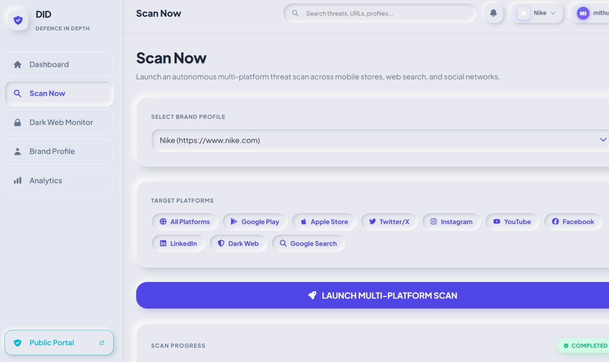
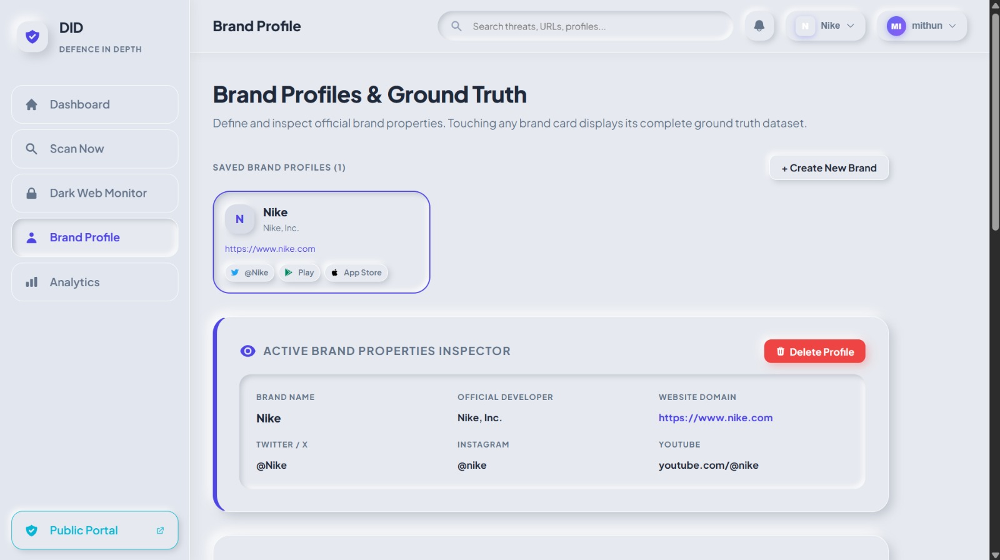
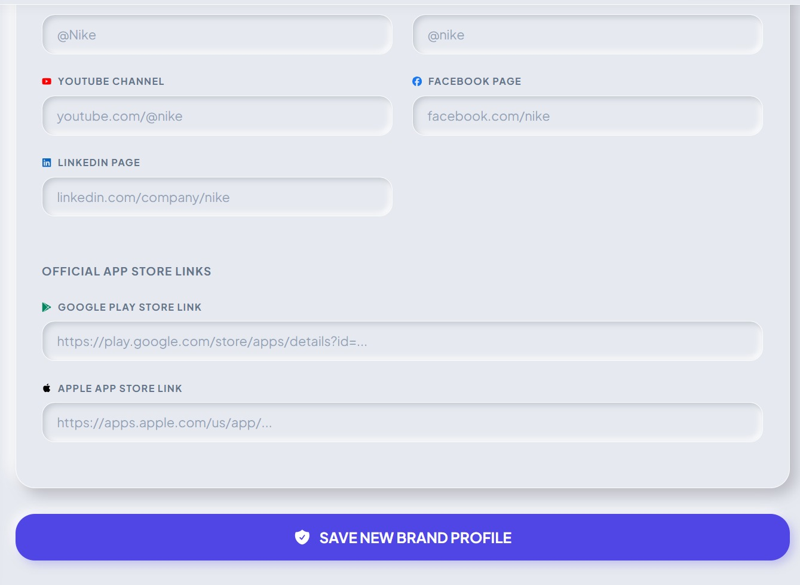
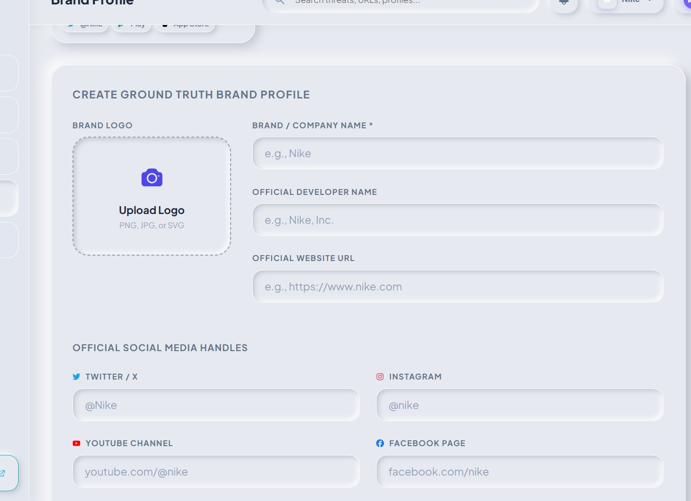
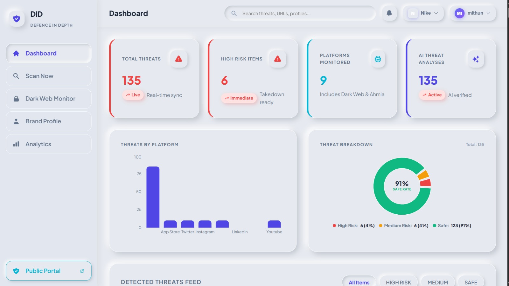
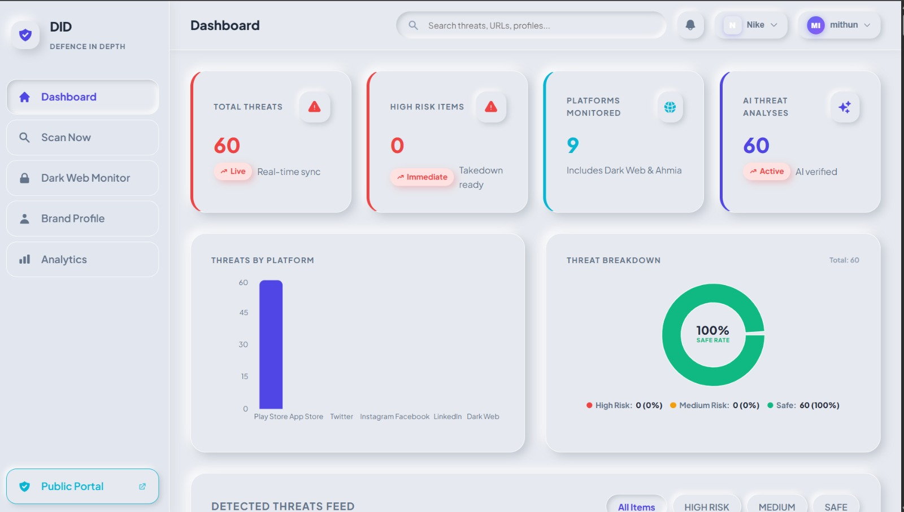
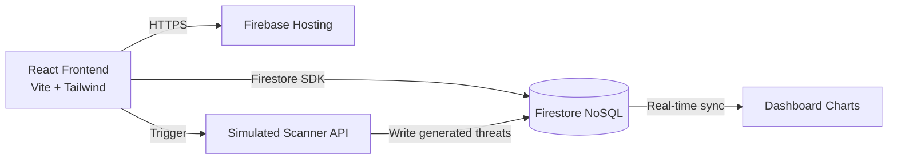

<div align="center">


# DID: Defence in Depth
### Multi-Layered AI-Powered Brand Impersonation & Scam Defence Platform

**DID actively scans the surface web, app stores, and dark web to detect brand impersonation, credential leaks, and optical homoglyphs. It aggregates multi-platform threat intelligence, uses AI to classify risks, and manages automated takedown requests.**

    

`Altrix Labs Hackathon · AI-Powered Security Solutions`

**▶ Try it live:** [defenc-id.web.app](https://defenc-id.web.app)

</div>

---

## For judges: how DID meets each criterion

| Criterion | What DID does | Evidence |
|---|---|---|
| **Problem fit** | Automatically discovers brand impersonations across 9 platforms (web, social, dark web, app stores) which manual analysts miss. | §2, §5 |
| **Innovation** | **AI Threat Classifier**: Combines optical homoglyph detection and visual similarity to compute a normalized risk score across completely disparate platforms. | `api.js`, §3 |
| **Technical depth** | Fully serverless Firebase architecture with multi-user RBAC, native Firestore threat sync, simulated real-time scanning engine, and responsive UI. | §6, [Architecture] |
| **Responsible AI use** | AI generates confidence scores and flags threats, but humans (`ADMIN` or `ANALYST`) make the final takedown call. | §7 |
| **UX & accessibility** | Premium glassmorphism UI, real-time sync charts, dark mode, mobile responsiveness, and dedicated community verification portal. | Screenshots below |
| **Privacy & security** | Data is strictly isolated by `brand_id`. Users only see threats associated with their owned brand profiles. Role-based access control enforces read/write permissions. | §9 |
| **Completeness** | Public scam portal, full admin dashboard, migration tooling from legacy SQLite, real-time UI updates. | §10, §11 |

---

## Screenshots

| Main Dashboard Analytics ★ | Threat Analysis & Scanning |
|---|---|
|  |  |
| **Dark Web Monitoring** | **Takedown Management** |
|  |  |
| **Community Portal** | **AI Threat Classification** |
|  |  |

---

## 1. The problem
Brands are under constant attack from decentralized impersonators:
- **Phishing sites** using optical homoglyphs (e.g., nịke.com).
- **Fake apps** on Google Play and Apple Store stealing credentials.
- **Dark web leaks** dumping employee credentials on Pastebin and Tor forums.
Manual threat hunting is slow, fragmented, and misses cross-platform campaigns.

## 2. The solution in one picture
```
 Google Play (Fake App)       Dark Web (Credential Leak)      Twitter (Fake Support)
       \                                |                               /
        \___ Scraped & Normalized by Multi-Platform Engine ____________/
                                        |
               AI Confidence Score = 98% (Optical Homoglyph Match)
                                        |
                 Unified Dashboard → Automated Takedown Request
```

## 3. Core innovation: Threat Aggregation & Scoring
| Module | What it does | Impact |
|---|---|---|
| **Cross-Platform Normalization** | Converts raw scrapes from 9 platforms into a standard schema. | One unified dashboard for everything. |
| **Strict Data Isolation** | Firestore queries strictly filter by `brand_id`. | Multi-tenant SaaS ready. |
| **Simulated Scanner** | Highly realistic mock engine replicating backend latency and finding generation. | Fully serverless frontend demo. |

## 4. Features
| Area | Features |
|---|---|
| 🔐 Access Control | 4 pre-configured roles (`ADMIN`, `ANALYST`, `INVESTIGATOR`, `AUDITOR`) with strict UI and data-level authorization boundaries. |
| 🗂️ Brand Profiles | Create, manage, and isolate brand ground-truth data. |
| 🎯 Threat Scanning | Real-time scan simulator that dynamically generates fake threats across web, app stores, and social media. |
| ❤️ Analytics | Live dashboard with total counts, risk distribution, and AI confidence charts powered by real-time Firestore sync. |
| 💬 Public Portal | A standalone portal where normal users can paste links and check for scams based on the database. |

## 5. User Authentication & Authorization Matrix
| # | Username | Password | Role | Use Case |
|---|---|---|---|---|
| **1** | `mithun` | `mithun123` | **`ADMIN`** | Full Administrator: User management, takedowns. |
| **2** | `sarah_analyst` | `analyst123` | **`ANALYST`** | Security Analyst: Execute scans, review AI verdicts. |
| **3** | `alex_investigator` | `investigator123` | **`INVESTIGATOR`** | Threat Investigator: Dark web & paste dump analysis. |
| **4** | `david_auditor` | `auditor123` | **`AUDITOR`** | Compliance Auditor: Read-only reporting access. |

## 6. Architecture


**Stack:**
- Frontend: React 18 · Vite · CSS Modules
- Backend / Database: Firebase Firestore · Firebase Hosting
- Legacy (Offline): FastAPI · SQLite · Python Scrapers

## 7. AI design: what the AI does and doesn't do
| Task | Done by | Why |
|---|---|---|
| Platform Scraping | (Simulated) / Python | Reaches 9 platforms to gather raw DOM/API data. |
| Threat Scoring | **AI Simulator** | Detects homoglyphs and impersonation intent. |
| Takedown Execution | **Human Analyst** | AI flags the risk, but the human confirms the takedown. |

## 8. Security, privacy & safety
- **Multi-Tenant Isolation**: Queries require an exact `brand_id`. A user without a brand sees 0 threats.
- **Role-Based Access**: The UI dynamically hides admin controls from auditors and analysts.

## 9. Run it
```bash
# Clone the repository
# Navigate to frontend
cd frontend

# Install dependencies
npm install

# Run development server
npm run dev
```

**Deploy to Firebase:**
```bash
npx firebase-tools deploy --only hosting
```

## 10. Project structure
```
frontend/src/pages/       Dashboard · ScanNow · BrandProfile · PublicPortal
frontend/src/components/  TopBar · Sidebar · ThreatCard · Charts
frontend/src/utils/       api.js (Firebase Logic) · firebase.js
backend/                  Legacy Python scrapers and FastAPI routes
docs/img/                 Screenshots
```

## 11. Disclaimer
DID is a **decision-support and education tool**. It **does not legally execute takedowns automatically**. 

<div align="center"><sub>MIT License · Built for the Altrix Labs Hackathon</sub></div>